# InvoiceFlow DevOps Infrastructure

A cost-optimized production-style DevOps deployment for a full-stack InvoiceFlow application using **AWS EC2, K3s, Terraform, Helm, ArgoCD, GitHub Actions, Docker Hub, Prometheus, and Grafana**.

This project demonstrates how a containerized full-stack application can be deployed using GitOps principles on a lightweight Kubernetes cluster without the high monthly cost of a full EKS-based setup.

---

## Project Overview

InvoiceFlow is deployed using a lightweight cloud-native architecture:

```txt
Developer pushes code to GitHub
        ↓
GitHub Actions builds Docker images
        ↓
Images are pushed to Docker Hub
        ↓
ArgoCD watches the GitHub repository
        ↓
ArgoCD deploys the Helm chart to K3s
        ↓
K3s runs frontend and backend containers
        ↓
Application is exposed through the EC2 public IP
```

This project was designed as a **budget-friendly alternative to EKS** while still demonstrating real DevOps practices such as infrastructure as code, containerization, Kubernetes deployment, GitOps, CI/CD, and monitoring.

---

## Architecture

```txt
                  Internet
                     |
                     v
              AWS EC2 Instance
                     |
         +-----------+-----------+
         |                       |
       K3s                    ArgoCD
         |
   +-----+-------------------------------+
   |                                     |
Frontend Pod                       Backend Pod
   |                                     |
Frontend Service                  Backend Service
   |                                     |
   +------------- Kubernetes ------------+
                     |
                PostgreSQL
          Container DB / Optional RDS
```

---

## Tech Stack

| Area                   | Technology           |
| ---------------------- | -------------------- |
| Cloud Provider         | AWS                  |
| Infrastructure as Code | Terraform            |
| Compute                | EC2                  |
| Kubernetes             | K3s                  |
| GitOps                 | ArgoCD               |
| Packaging              | Helm                 |
| CI/CD                  | GitHub Actions       |
| Container Registry     | Docker Hub           |
| Frontend               | React / Vite         |
| Backend                | Node.js / Express    |
| Database               | PostgreSQL           |
| Monitoring             | Prometheus + Grafana |
| OS                     | Amazon Linux         |

---

## Repository Structure

```txt
invoiceflow-devops-infrastructure/
├── app/
│   ├── frontend/
│   └── backend/
│
├── helm/
│   └── invoiceflow/
│       ├── Chart.yaml
│       ├── values.yaml
│       └── templates/
│
├── argocd/
│   └── application.yaml
│
├── terraform/
│   ├── provider.tf
│   ├── variables.tf
│   ├── main.tf
│   ├── security-group.tf
│   ├── user-data.sh.tpl
│   └── outputs.tf
│
├── .github/
│   └── workflows/
│       └── docker-build.yml
│
└── README.md
```

---

## Infrastructure Design

This project uses a cost-optimized setup instead of a full EKS architecture.

### Why K3s Instead of EKS?

A full EKS-based production setup usually requires:

* EKS control plane
* Managed node groups
* NAT Gateway
* Load Balancer
* RDS
* Public IPv4 charges

That setup is more expensive.

This project uses:

* Single EC2 instance
* K3s Kubernetes
* ArgoCD
* Helm
* Docker Hub
* Optional lightweight monitoring

This keeps cost low while still showing practical DevOps skills.

---

## CI/CD Workflow

GitHub Actions automatically builds and pushes Docker images when changes are made inside the `app/` folder.

Workflow trigger:

```yaml
on:
  push:
    branches:
      - main
    paths:
      - "app/**"
      - ".github/workflows/docker-build.yml"
```

The workflow builds:

```txt
invoicebackend:v2
invoicebackend:<github-sha>

invoicefrontend:v2
invoicefrontend:<github-sha>
```

These images are pushed to Docker Hub and then used by the Helm chart.

---

## GitOps Deployment Flow

ArgoCD watches the Helm chart path:

```txt
helm/invoiceflow
```

When the Helm chart or values file changes, ArgoCD automatically syncs the application into the `invoiceflow` namespace.

```txt
GitHub Repository
      ↓
ArgoCD Application
      ↓
Helm Chart
      ↓
K3s Cluster
      ↓
InvoiceFlow Pods
```

---

## Terraform Deployment

### 1. Go to Terraform folder

```bash
cd terraform
```

### 2. Initialize Terraform

```bash
terraform init
```

### 3. Format Terraform files

```bash
terraform fmt
```

### 4. Validate configuration

```bash
terraform validate
```

### 5. Preview infrastructure

```bash
terraform plan
```

### 6. Apply infrastructure

```bash
terraform apply
```

Type:

```txt
yes
```

Terraform creates the EC2 instance and runs the user-data script to install K3s and ArgoCD.

---

## User Data Bootstrap

The EC2 user-data script performs the initial server bootstrap:

```txt
1. Install required packages
2. Install K3s
3. Configure kubeconfig for ec2-user
4. Create invoiceflow namespace
5. Create Kubernetes Secret
6. Install ArgoCD
7. Wait for ArgoCD CRD
8. Apply the ArgoCD Application manifest
```

Monitoring is intentionally not installed in user-data because Prometheus and Grafana can be heavy.

---

## Useful Commands

### Check K3s node

```bash
sudo kubectl get nodes
```

### Check all pods

```bash
sudo kubectl get pods -A
```

### Check InvoiceFlow resources

```bash
sudo kubectl get pods -n invoiceflow
sudo kubectl get svc -n invoiceflow
sudo kubectl get ingress -n invoiceflow
```

### Check ArgoCD application

```bash
sudo kubectl get applications -n argocd
sudo kubectl describe application invoiceflow -n argocd
```

### Check user-data logs

```bash
sudo tail -n 100 /var/log/invoiceflow-userdata.log
```

---

## Accessing ArgoCD UI

ArgoCD is accessed securely using port-forwarding instead of exposing it publicly.

### 1. Get ArgoCD admin password

Run inside EC2:

```bash
sudo kubectl -n argocd get secret argocd-initial-admin-secret \
  -o jsonpath="{.data.password}" | base64 -d; echo
```

Username:

```txt
admin
```

### 2. Port-forward ArgoCD

Inside EC2:

```bash
sudo kubectl -n argocd port-forward svc/argocd-server 8080:443 --address 127.0.0.1
```

On local machine:

```bash
ssh -i "path/to/key.pem" -L 8080:127.0.0.1:8080 ec2-user@EC2_PUBLIC_IP
```

Open:

```txt
https://localhost:8080
```

---

## Monitoring

This project uses a lightweight Prometheus and Grafana setup instead of the full `kube-prometheus-stack`.

### Install Prometheus

```bash
sudo KUBECONFIG=/etc/rancher/k3s/k3s.yaml helm repo add prometheus-community https://prometheus-community.github.io/helm-charts
sudo KUBECONFIG=/etc/rancher/k3s/k3s.yaml helm repo add grafana https://grafana.github.io/helm-charts
sudo KUBECONFIG=/etc/rancher/k3s/k3s.yaml helm repo update
```

```bash
sudo KUBECONFIG=/etc/rancher/k3s/k3s.yaml helm upgrade --install prometheus prometheus-community/prometheus \
  --namespace monitoring \
  --create-namespace \
  --set alertmanager.enabled=false \
  --set pushgateway.enabled=false \
  --set server.persistentVolume.enabled=false \
  --set server.retention=6h \
  --set server.resources.requests.cpu=100m \
  --set server.resources.requests.memory=256Mi \
  --set server.resources.limits.cpu=300m \
  --set server.resources.limits.memory=512Mi
```

### Install Grafana

```bash
sudo KUBECONFIG=/etc/rancher/k3s/k3s.yaml helm upgrade --install grafana grafana/grafana \
  --namespace monitoring \
  --set adminPassword=admin123 \
  --set persistence.enabled=false \
  --set service.type=ClusterIP \
  --set resources.requests.cpu=50m \
  --set resources.requests.memory=128Mi \
  --set resources.limits.cpu=200m \
  --set resources.limits.memory=256Mi
```

### Check monitoring pods

```bash
sudo kubectl get pods -n monitoring
sudo kubectl get svc -n monitoring
```

---

## Accessing Grafana

Inside EC2:

```bash
sudo kubectl -n monitoring port-forward svc/grafana 3000:80 --address 127.0.0.1
```

On local machine:

```bash
ssh -i "path/to/key.pem" -L 3000:127.0.0.1:3000 ec2-user@EC2_PUBLIC_IP
```

Open:

```txt
http://localhost:3000
```

Login:

```txt
Username: admin
Password: admin123
```

---

## Example Prometheus Queries

### Check targets

```promql
up
```

### EC2 CPU usage

```promql
100 - (avg by(instance) (rate(node_cpu_seconds_total{mode="idle"}[5m])) * 100)
```

### EC2 memory usage

```promql
(1 - (node_memory_MemAvailable_bytes / node_memory_MemTotal_bytes)) * 100
```

### EC2 disk usage

```promql
100 - ((node_filesystem_avail_bytes{mountpoint="/"} * 100) / node_filesystem_size_bytes{mountpoint="/"})
```
---

### Notes:
K8 folder was created for local kubernetes testing before implementing helm.</br></br>
There is no HPA on kubernetes or Autoscaling on EC2 because this is a simple project built to run on a single EC2 instance with limited CPU and memory.

---

## Screenshots of Local Testing done before deploying to AWS Infrastructure

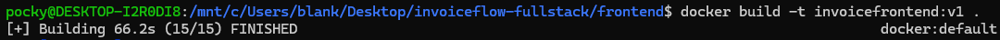
<br/><br/>
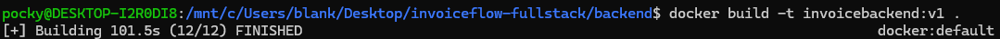
<br/><br/>
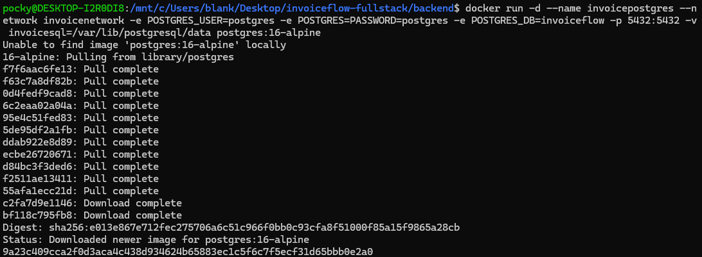
<br/><br/>
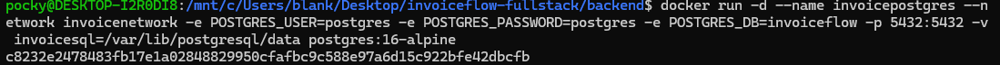
<br/><br/>
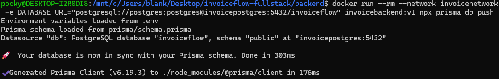
<br/><br/>
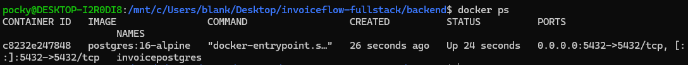
<br/><br/>
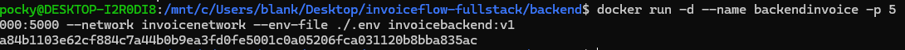
<br/><br/>
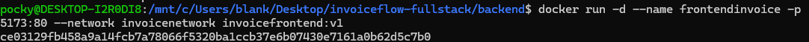
<br/><br/>
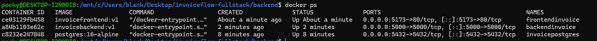
<br/><br/>
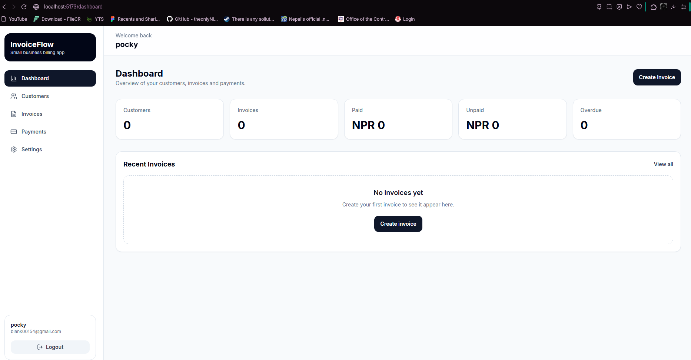
<br/><br/>
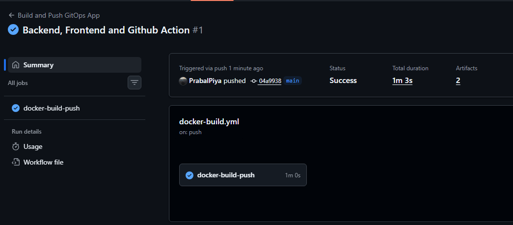
<br/><br/>
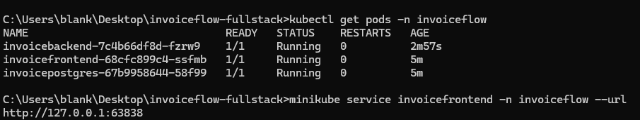
<br/><br/>
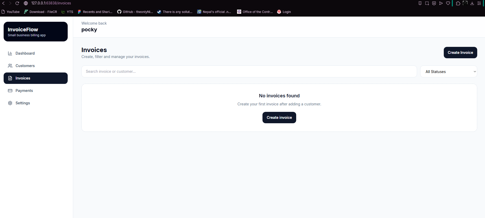
<br/><br/>
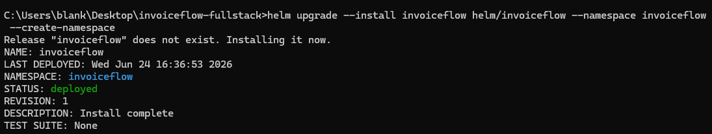
<br/><br/>
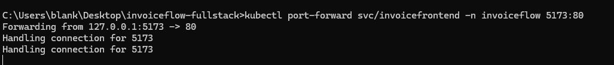
<br/><br/>
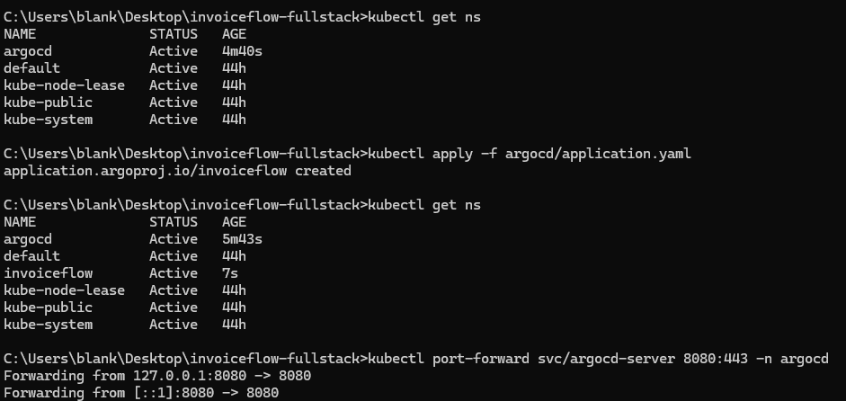
<br/><br/>
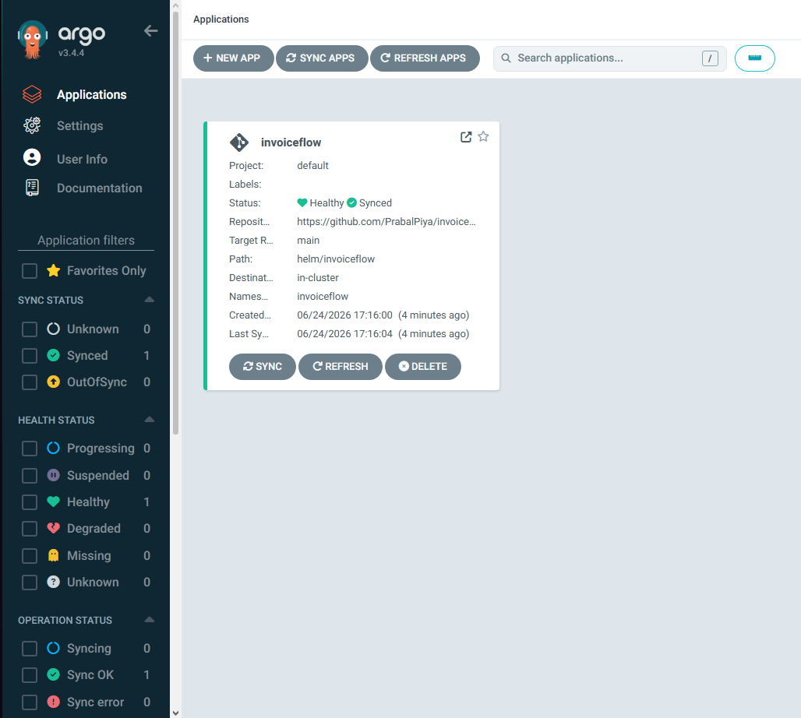
<br/><br/>
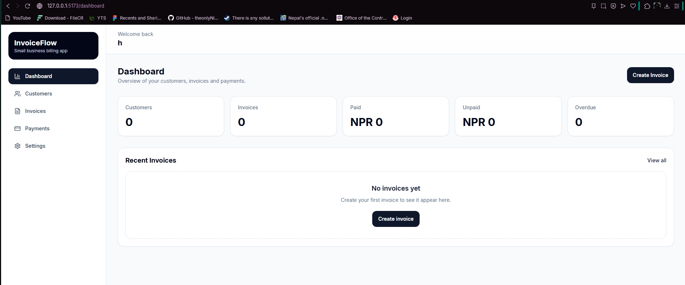
<br/><br/>
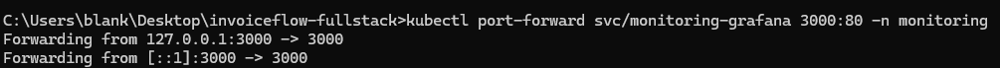
<br/><br/>
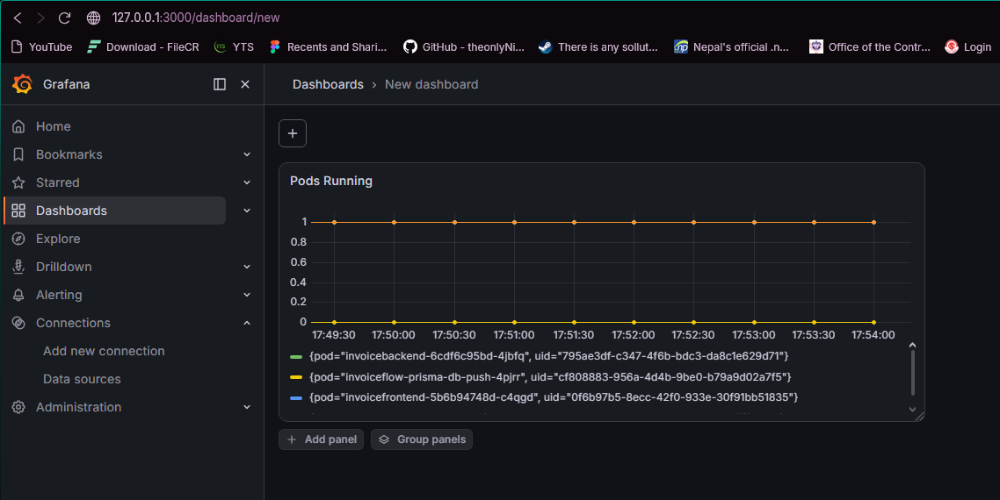
<br/><br/>
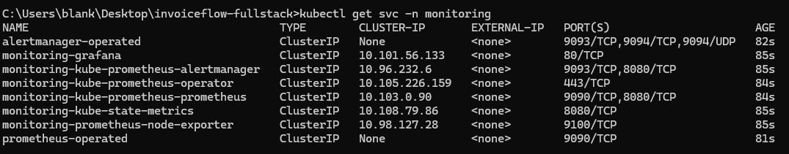
<br/><br/>
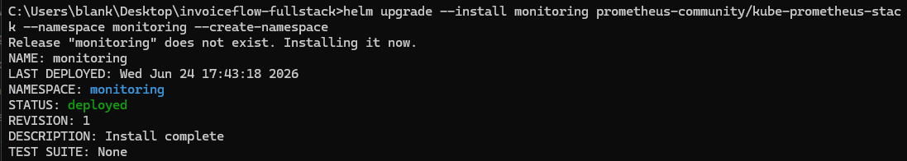
<br/><br/>
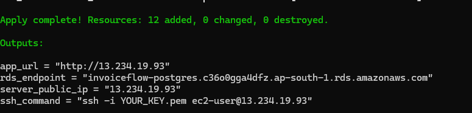
<br/><br/>
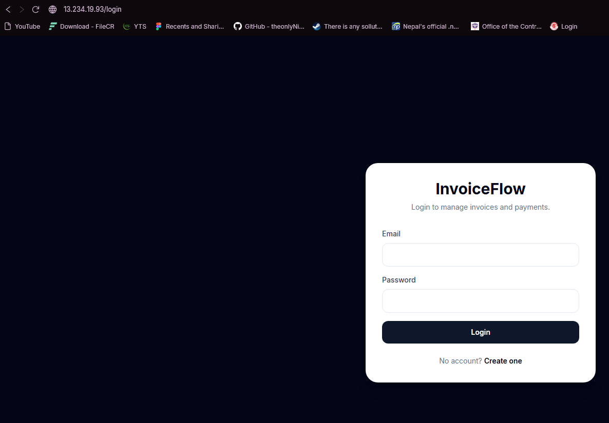

---


